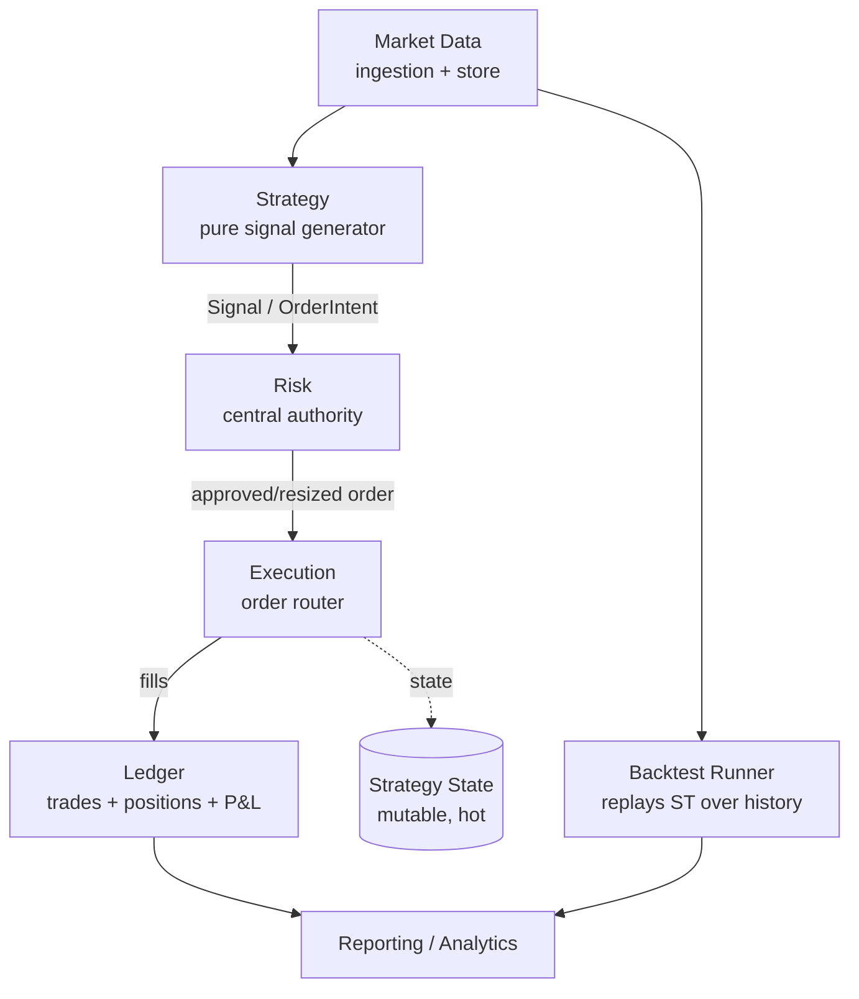

# HTB trading-system layer model

The system is a one-directional pipeline. Data flows down; nothing downstream mutates an upstream layer. Each layer has one job and a narrow contract. The single most important structural rule:

> **The strategy proposes. The risk layer disposes. The execution layer does — exactly once.**



## 1. Market data (implemented — the reference pattern)

The only fully built layer. Study it before designing anything else; new layers should feel like siblings of it.

- **Ingestion** (`HTB.MarketData.Loader`): pulls klines from an exchange client, maps to the domain `Candle`, upserts idempotently. Resumes from the last stored bar; **never persists a still-forming bar** (`IsClosed`/close-time guard). Streams pages via `IAsyncEnumerable` and flushes incrementally.
- **Store**: PostgreSQL + **TimescaleDB hypertable** on `candles`, partitioned by `open_time`. Natural key `(exchange_id, symbol_id, interval, open_time)`. Writes are `INSERT … ON CONFLICT … DO UPDATE` so backfill + live ingest overlap safely.
- **Read side** lives in `HTB.Shared` (`ICandleRepository`) so *any* consumer — backtest, analytics, the loader's own resume logic — reads history without depending on the loader.

**Invariants:** every persisted bar is closed/final; reads are no-tracking; writes idempotent on the natural key; time is UTC `DateTimeOffset`; prices/sizes are `decimal`.

**Contract (read, in Shared):**
```csharp
Task<IReadOnlyList<Candle>> GetRangeAsync(int symbolId, Timeframe interval,
    DateTimeOffset from, DateTimeOffset to, CancellationToken ct = default);
Task<Candle?> GetLatestAsync(int symbolId, Timeframe interval, CancellationToken ct = default);
```

## 2. Strategy — pure, deterministic signal generator

A strategy is a **pure function of market data → signal**. Same candles in ⇒ same signal out (the ruleset literally flags `deterministic: true`). No I/O, no clock, no randomness, no order placement.

- **Inputs:** a window of closed candles (+ derived indicators: RSI, EMA, …). Declares `requiredDataInputs` and `requiredIndicators`.
- **Output:** a `Signal` / `OrderIntent` (open_long, close_long, hold, …) — an *intent*, not an order.
- **Parameters:** a typed, bounded `parameterSpec` (min/max/default) + a config hash + a version number. Strategy config is versioned and immutable once active.
- **Requested risk** (stop-loss %, take-profit %, max position) is advisory — the strategy *asks*; risk decides.

**Why pure:** determinism makes backtest == live (the same strategy object runs in both), makes every branch unit-testable with hand-built candle arrays, and eliminates an entire class of look-ahead bugs. Design indicators to be incremental/streaming but referentially transparent.

**Invariants:** no look-ahead (never read a bar at or after the decision bar's close); evaluate on `candle_close`; deterministic; side-effect free.

## 3. Risk — the central authority

A single chokepoint every order intent passes through. **It has final say and may veto or resize any order.** Strategies cannot bypass it.

- Enforces: max position size (absolute & % of equity), max open positions, daily-loss limit, drawdown **kill switch**, cooldown-after-loss, per-instrument min-notional / min-order-size.
- Stateful: needs current equity, open positions, realized P&L for the day → reads the ledger/state layer.
- Output: an approved (possibly resized) order, or a rejection with a reason. Rejections are first-class, logged outcomes — not exceptions.

**Invariants:** no order reaches execution un-vetted; limits are evaluated against *live* state, not the strategy's assumptions; kill-switch is sticky until reset; risk is the one place that knows portfolio-wide context.

## 4. Execution — idempotent order router

Translates an approved order into exchange API calls and reconciles fills.

- Order type / TIF / post-only / slippage tolerance from the ruleset's `execution` block.
- **Retry with backoff** (max attempts, multiplier) — and therefore **idempotency keys** (`{strategyId}:{versionNumber}:{signalTimestamp}` template) so a retried send never double-fills.
- Owns the exchange-client abstraction (like `IBinanceMarketDataClient`, but for trading). Exchange-specific code lives behind the interface; the router is venue-agnostic.
- Emits fills to the ledger; updates strategy state.

**Invariants:** at-most-once economic effect under retries (idempotency key); a partial fill is a real state, modeled explicitly; never assume a send succeeded without confirmation/reconciliation; honor rate limits.

## 5. Ledger & state — two different stores, on purpose

- **Strategy runtime state** — `strategy_state`: mutable, overwrite-in-place, hot read/write. Holds open position, last signal, last-evaluated time, daily realized P&L, kill-switch flag. Optimistic concurrency / single-writer per strategy.
- **Trade history** — `trades`: **append-only, immutable audit log.** Every row references `strategyVersionNumber + instrumentId`, carries fee, order id, executed-at. Never updated or deleted — it's the source of truth for P&L and compliance.
- **Positions / portfolio**: derived from the trade log (and reconciled against the exchange). P&L is computed, not guessed.

**Invariants:** the trade log is the ledger of record; state is a cache/projection that can be rebuilt; money in == money out + fees + P&L (conservation); every mutation is auditable.

## 6. Backtest — same strategy, historical candles

Replays the *exact* strategy code over `ICandleRepository` history. Models fees and slippage explicitly. Produces metrics: total/annualized return, Sharpe, Sortino, max drawdown, win rate, profit factor, trade count, avg duration.

**Invariants:** feed only closed bars in chronological order (no look-ahead); model costs (fees + slippage) or results are fiction; treat metrics as optimistic — validate across regimes and on paper before live. The backtest engine and live engine share the strategy + risk evaluation core; only the data source and order sink differ (Strategy-pattern data feed + order sink).

## Cross-cutting rules

- **One direction of dependency.** Shared domain + read contracts at the bottom (`HTB.Shared`); services depend on Shared, never the reverse; the composition root wires concretes.
- **Venue-agnostic core.** Exchanges are rows/config behind client interfaces. Adding Coinbase = a new client impl + an exchange row, not a domain change.
- **Determinism boundary.** Everything testable and pure (strategy, indicators, risk rules, mapping, P&L math) is separated from everything effectful (HTTP, DB, clock) so the first group hits 100% coverage trivially and the second is thin and seam-able.
- **Idempotency at every write edge.** Ingestion upserts, order sends keyed, get-or-create for reference data.
