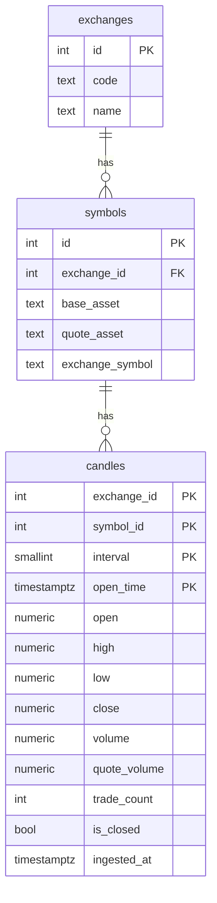

# Market Data Storage — Database & Migration Layer

Architecture of how HTB stores crypto market quotes. Scope is **OHLCV candles**
(klines), exchange-agnostic, persisted by the `HTB.MarketData.Data` project.

## Tech stack

| Concern        | Choice                                          |
| -------------- | ----------------------------------------------- |
| Database       | PostgreSQL + **TimescaleDB** extension          |
| Access / ORM   | EF Core (Npgsql provider)                       |
| Migrations     | EF Core code-first migrations                   |
| Time-series    | `candles` stored as a TimescaleDB hypertable    |

`HTB.MarketData.Data` owns the `DbContext`, entity configuration, migrations, and
repositories. Domain primitives (`Symbol`, `Interval`, `Candle`) come from `HTB.Shared`.
*(Names are proposed; the projects are still scaffolding.)*

## Data model



### Rules

- **Natural key:** `(exchange_id, symbol_id, interval, open_time)`. It includes
  `open_time`, which is required for the TimescaleDB hypertable partition column.
- **Money/size** columns are `numeric` (decimal) — never floating point.
- **Time** is always `timestamptz` in UTC. `interval` is a `smallint` enum
  (1m, 5m, 15m, 1h, 4h, 1d, …).
- `is_closed = false` marks the still-forming candle; it is overwritten on each
  update until the bar closes.

## Schema (DDL)

```sql
CREATE TABLE exchanges (
    id   serial PRIMARY KEY,
    code text NOT NULL UNIQUE,
    name text NOT NULL
);

CREATE TABLE symbols (
    id              serial PRIMARY KEY,
    exchange_id     int  NOT NULL REFERENCES exchanges(id),
    base_asset      text NOT NULL,
    quote_asset     text NOT NULL,
    exchange_symbol text NOT NULL,
    UNIQUE (exchange_id, exchange_symbol)
);

CREATE TABLE candles (
    exchange_id  int         NOT NULL,
    symbol_id    int         NOT NULL REFERENCES symbols(id),
    interval     smallint    NOT NULL,
    open_time    timestamptz NOT NULL,
    open         numeric     NOT NULL,
    high         numeric     NOT NULL,
    low          numeric     NOT NULL,
    close        numeric     NOT NULL,
    volume       numeric     NOT NULL,
    quote_volume numeric     NOT NULL,
    trade_count  int         NOT NULL,
    is_closed    boolean     NOT NULL,
    ingested_at  timestamptz NOT NULL DEFAULT now(),
    PRIMARY KEY (exchange_id, symbol_id, interval, open_time)
);

-- Latest-candle / range-scan access path
CREATE INDEX ix_candles_symbol_interval_time
    ON candles (symbol_id, interval, open_time DESC);

-- Turn candles into a time-partitioned hypertable
SELECT create_hypertable('candles', 'open_time');
```

## Migrations

Code-first with EF Core. The migrations assembly lives in `HTB.MarketData.Data`.

```bash
dotnet ef migrations add InitialCreate -p src/marketdata/HTB.MarketData.Data
dotnet ef database update            -p src/marketdata/HTB.MarketData.Data
```

Tables are created from the EF model; TimescaleDB-specific DDL (extension,
hypertable, policies) is applied with raw SQL inside the migration:

```csharp
protected override void Up(MigrationBuilder migrationBuilder)
{
    // ... CreateTable(exchanges), CreateTable(symbols), CreateTable(candles) ...

    migrationBuilder.Sql("CREATE EXTENSION IF NOT EXISTS timescaledb;");
    migrationBuilder.Sql("SELECT create_hypertable('candles', 'open_time');");
}

protected override void Down(MigrationBuilder migrationBuilder)
{
    migrationBuilder.DropTable("candles");
    migrationBuilder.DropTable("symbols");
    migrationBuilder.DropTable("exchanges");
}
```

**Conventions:** one logical change per migration, forward-only in production,
every `Up` has a matching `Down`.

## Writing candles (idempotent upsert)

Backfill and live updates can both touch the same bar, so writes are idempotent on
the natural key. The open candle is overwritten until it closes; re-running a
backfill is a no-op for unchanged rows.

```sql
INSERT INTO candles (exchange_id, symbol_id, interval, open_time,
                     open, high, low, close, volume, quote_volume,
                     trade_count, is_closed)
VALUES (...)
ON CONFLICT (exchange_id, symbol_id, interval, open_time)
DO UPDATE SET high = EXCLUDED.high,
              low  = EXCLUDED.low,
              close = EXCLUDED.close,
              volume = EXCLUDED.volume,
              quote_volume = EXCLUDED.quote_volume,
              trade_count = EXCLUDED.trade_count,
              is_closed = EXCLUDED.is_closed,
              ingested_at = now();
```

## TimescaleDB operations (optional, later)

- **Compression** — compress old chunks, segmented by `symbol_id, interval`.
- **Retention** — drop chunks older than a configured window.
- **Continuous aggregates** — roll up 1m candles into 1h/1d views.

Each is applied through a migration via `migrationBuilder.Sql(...)`.
