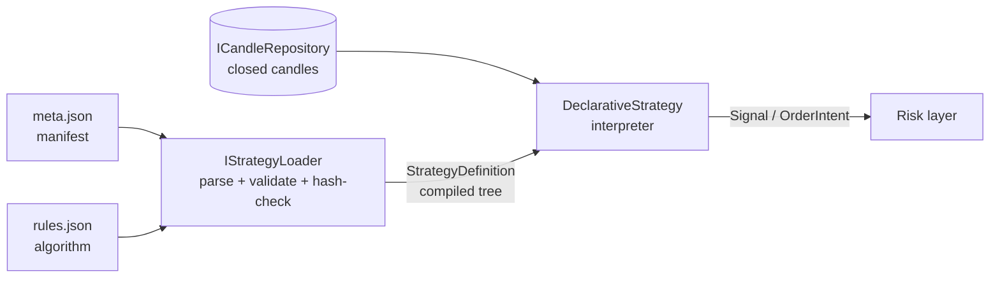

# Strategy JSON Format

> Status: **Draft / proposal** — schema `1.0`. Reference implementation: [`strategies/rsi-movement/`](../strategies/rsi-movement/).
> Layer: **Strategy** (the pure, deterministic signal generator). See [`.claude/skills/architect/references/trading-architecture.md`](../.claude/skills/architect/references/trading-architecture.md) §2.

## 1. Summary

A strategy in HTB is a **pure function of closed candles → signal**: same candles in ⇒ same signal out, no I/O, no clock, no randomness, no order placement. This document defines how such a strategy is expressed **as data** (not code) in two JSON files, so a strategy can be authored, versioned, hashed, registered, backtested, and run live without recompiling the engine.

The strategy is split into **two files per version**:

| File | Role | Audience / consumer | Volatility |
| --- | --- | --- | --- |
| `meta.json` | **Manifest** — identity, version, lifecycle, applicability, parameter spec | Registry, backtest selection, governance, audit | Stable, governance-controlled |
| `rules.json` | **Algorithm** — indicators + entry/exit condition tree + requested risk + execution hints | The strategy engine (interpreter) | Where the trading logic lives |

The manifest **binds** the algorithm by hash: `meta.version.rules-hash = sha256(rules.json)`. Once a version is `active`, both files are immutable; a change is a *new version number*, never an edit. This is the same "versioned & immutable once active" rule the architecture reference states for strategy config.



## 2. Invariants (these drive the design)

1. **Determinism.** The engine evaluating `rules.json` over a fixed candle window always yields the same signal. The DSL has no time, no RNG, no I/O operands. `meta.deterministic` must be `true` for schema `1.0` (the field exists so a future non-deterministic escape hatch is an explicit, auditable opt-in, not a silent one).
2. **No look-ahead.** Every operand reads the **decision bar at offset 0 (already closed)** or **further into the past** (`offset ≥ 1`). Negative offsets are a schema error. Cross-operators (`crosses-above`/`crosses-below`) encapsulate the offset-1 look-back so authors never hand-roll it and cannot accidentally peek forward.
3. **Bounded parameters.** Every `$param` referenced by `rules.json` must be declared in `meta.parameters` with `min`/`max`/`default`; the loader rejects out-of-range or undeclared references. Strategy parameters cannot be free-form.
4. **Immutability by hash.** A loaded `rules.json` whose `sha256` ≠ `meta.version.rules-hash` is rejected. The pair `(strategy-id, version-number)` is the natural key everywhere downstream (trades, state, backtest runs reference it).
5. **Intent, not orders.** `requested-risk` and `execution` are **advisory**. The strategy *asks*; the risk layer disposes and may veto/resize. Nothing here places an order.
6. **Exchange-agnostic.** `applicability.exchanges` / `symbols` are *strings/config*, resolved to ids at load time. No venue is ever a type.

## 3. Conventions

- **Keys: `kebab-case`** (consistent with the existing [`symbols.json`](../src/marketdata/HTB.MarketData.Loader/symbols.json)). On the .NET side this maps cleanly via `JsonSerializerOptions { PropertyNamingPolicy = JsonNamingPolicy.KebabCaseLower }` (built into .NET 10's `System.Text.Json`) — no per-property `[JsonPropertyName]` attributes needed.
- **Money / thresholds: decimal-valued JSON numbers**, parsed to `decimal` (never `double`).
- **Time: ISO-8601 UTC** (`...Z`), parsed to `DateTimeOffset`.
- **Timeframe: the existing `Timeframe` enum names** (`M1`, `M5`, `M15`, `H1`, `H4`, `D1`).
- **Identifiers inside the DSL (indicator `id`s, candle fields) are English, kebab-case** to match the keys.

## 4. File 1 — `meta.json` (the manifest)

```jsonc
{
  "schema-version": "1.0",
  "id": "rsi-movement",                 // stable slug; natural-key part #1
  "name": "RSI Movement",
  "description": "Long-only mean reversion: buy oversold RSI in an uptrend, exit on overbought or trend break.",
  "author": "paul",
  "deterministic": true,                // must be true for schema 1.0

  "version": {
    "number": 1,                        // monotonic int; natural-key part #2; immutable once active
    "status": "draft",                  // draft | active | retired
    "created-at": "2026-06-26T00:00:00Z",
    "rules-hash": "sha256:<64 hex>"     // binds the rules.json this version runs
  },

  "applicability": {
    "exchanges": ["binance"],           // config, resolved to exchange ids at load
    "symbols": ["BTCUSDT", "ETHUSDT"],
    "timeframe": "H1",                   // primary decision timeframe
    "warmup-bars": 200                  // bars to skip before signals are valid (longest indicator lookback)
  },

  "parameters": {                       // the bounded parameter spec; the only $params rules.json may use
    "rsi-period":     { "type": "int",     "default": 14,  "min": 2,  "max": 50 },
    "rsi-oversold":   { "type": "decimal", "default": 30,  "min": 5,  "max": 45 },
    "rsi-overbought": { "type": "decimal", "default": 70,  "min": 55, "max": 95 },
    "ema-period":     { "type": "int",     "default": 200, "min": 20, "max": 400 }
  },

  "tags": ["mean-reversion", "rsi", "trend-filter"]
}
```

| Field | Type | Notes / invariant |
| --- | --- | --- |
| `schema-version` | string | Format version; gates the parser. |
| `id` | string (slug) | Stable strategy identity; folder name; natural key #1. |
| `version.number` | int | Natural key #2. New logic ⇒ new number, never an edit. |
| `version.status` | enum | `draft` (editable), `active` (immutable, runnable), `retired` (no new runs). |
| `version.rules-hash` | string | `sha256` of `rules.json`; mismatch ⇒ load fails. |
| `applicability.warmup-bars` | int | Engine discards signals until this many closed bars are buffered (guards indicator validity). |
| `parameters.*` | spec | `type ∈ {int, decimal}`, `min ≤ default ≤ max`. The closed set of `$param` names. |

**Why parameters live in the manifest, not the rules:** the bounds are a *governance contract* (what a tuner / optimizer is allowed to sweep, what risk review signs off on). `rules.json` only *references* params by name; it never defines their legal range.

## 5. File 2 — `rules.json` (the algorithm)

```jsonc
{
  "schema-version": "1.0",
  "strategy-id": "rsi-movement",        // must equal meta.id
  "version-number": 1,                  // must equal meta.version.number

  "indicators": [                       // declared once, referenced by id in the rules
    { "id": "rsi",      "kind": "rsi", "source": "close", "period": "$rsi-period" },
    { "id": "ema-slow", "kind": "ema", "source": "close", "period": "$ema-period" }
  ],

  "rules": {
    "entry-long": {                     // condition tree → true means "emit OpenLong"
      "all": [
        { "lt": ["rsi", "$rsi-oversold"] },
        { "gt": ["close", "ema-slow"] }
      ]
    },
    "exit-long": {                      // true means "emit CloseLong"
      "any": [
        { "gt": ["rsi", "$rsi-overbought"] },
        { "crosses-below": ["close", "ema-slow"] }
      ]
    }
  },

  "requested-risk": {                   // ADVISORY — the risk layer has final say
    "stop-loss-pct": 2.0,
    "take-profit-pct": 4.0,
    "max-position-pct": 10.0
  },

  "execution": {                        // hints for the order router
    "order-type": "market",            // market | limit
    "time-in-force": "gtc",            // gtc | ioc | fok
    "slippage-tolerance-pct": 0.1
  }
}
```

The engine evaluates `entry-long` and `exit-long` **on every closed decision bar**, in a fixed precedence (exit-before-entry when flat-vs-in-position is ambiguous — see §6.4). The result is a `Signal`, handed upstream-of-risk as an `OrderIntent`.

### 5.1 Indicators

Each entry declares a derived series the rules can reference by `id`.

| Field | Notes |
| --- | --- |
| `id` | Unique within the file; the name used as an operand. |
| `kind` | From a **closed registry** of indicator implementations (`rsi`, `ema`, `sma`, … extended deliberately). Unknown kind ⇒ load error. |
| `source` | Candle field the indicator consumes (`close`, `open`, `high`, `low`, `volume`). |
| `period` / other params | Literal number or `$param` reference. |

Indicators are **incremental and referentially transparent** (streaming state, but same inputs ⇒ same output), so backtest == live.

### 5.2 The condition DSL

A condition node is one of:

- **Boolean combinator** — `{ "all": [ ...nodes ] }`, `{ "any": [ ...nodes ] }`, `{ "not": node }`.
- **Comparison** — `{ "<op>": [ left-operand, right-operand ] }` where `<op> ∈ { gt, gte, lt, lte, eq }`.
- **Cross** — `{ "crosses-above": [a, b] }` / `{ "crosses-below": [a, b] }`. `crosses-above` is true when `a ≤ b` at offset 1 **and** `a > b` at offset 0. Encapsulates the only sanctioned look-back.

An **operand** resolves to a `decimal` and is one of:

| Form | Example | Resolves to |
| --- | --- | --- |
| Candle field | `"close"` | The decision bar's close. |
| Indicator id | `"rsi"` | Current value of that series. |
| Parameter ref | `"$rsi-oversold"` | The bound parameter value. |
| Literal | `30` | A constant. |
| Past value | `{ "series": "rsi", "offset": 1 }` | The series one closed bar ago (`offset ≥ 0` only). |

**Look-ahead is structurally impossible:** there is no operand that names a future bar; `offset` is unsigned; the engine only ever feeds closed bars in chronological order. This is the single most important safety property and it lives in the *type of the operand*, not in a runtime check you can forget.

## 6. .NET mapping & boundaries

Everything **read** here (the parsed manifest + compiled definition) is consumed by the backtest runner, the live engine, analytics, and the registry — so it lives in **`HTB.Shared`**, mirroring how `ICandleRepository` and `Candle` live there. Writing/registering new versions is a **service** concern (a future `HTB.Strategy.Registry`), not Shared.

```
src/shared/HTB.Shared/Strategy/
├── Domain/
│   ├── StrategyManifest.cs        // record ← meta.json
│   ├── StrategyVersion.cs         // record { int Number, StrategyStatus Status, DateTimeOffset CreatedAt, string RulesHash }
│   ├── StrategyStatus.cs          // enum : short { Draft = 1, Active = 2, Retired = 3 }
│   ├── ParameterSpec.cs           // record { ParameterType Type, decimal Default, decimal Min, decimal Max }
│   ├── StrategyRules.cs           // record ← rules.json (indicators + rule trees + requested risk + execution)
│   ├── Signal.cs                  // enum : short { Hold = 0, OpenLong = 1, CloseLong = 2, ... }
│   └── Conditions/                // the compiled DSL
│       ├── ICondition.cs          // IsSatisfiedBy(EvaluationContext) : bool        (Specification)
│       ├── IOperand.cs            // Evaluate(EvaluationContext) : decimal           (Interpreter)
│       ├── AllCondition.cs, AnyCondition.cs, NotCondition.cs
│       ├── ComparisonCondition.cs, CrossCondition.cs
│       └── SeriesOperand.cs, ParameterOperand.cs, LiteralOperand.cs
├── Abstractions/
│   ├── IStrategyLoader.cs         // (manifestJson, rulesJson) → StrategyDefinition  (parse+validate+hash)
│   ├── IStrategy.cs               // Evaluate(EvaluationContext) → Signal             (Strategy pattern)
│   └── IIndicator.cs              // incremental, pure
└── Strategy/
    ├── DeclarativeStrategy.cs     // IStrategy that walks the compiled condition tree
    ├── StrategyLoader.cs          // JSON → records → validated, hashed StrategyDefinition
    └── Indicators/                // Rsi.cs, Ema.cs, Sma.cs (registry of kinds)
```

`StrategyDefinition` = `StrategyManifest` + compiled `StrategyRules` (the validated, ready-to-run object). `EvaluationContext` = the candle window + resolved parameter values + current indicator outputs at the decision bar.

> The `src/shared/HTB.Shared/Strategy/Domain/Events/` folder that exists today is for a *later* event-sourcing concern; this format does not need it. The records above are plain immutable value objects.

## 7. Patterns

| Pattern | Where | One-line justification |
| --- | --- | --- |
| **Strategy** (GoF) | `IStrategy` / `DeclarativeStrategy` | A strategy is swappable behavior selected by config; the engine is the context. |
| **Interpreter** (GoF) | `IOperand` / `ICondition` tree | `rules.json` is a little language; the compiled tree *is* the AST evaluated per bar. |
| **Specification** (DDD) | `ICondition` + `all`/`any`/`not` | Composable boolean rules over a candidate (the decision bar). |
| **Builder / Factory** | `StrategyLoader` | One place turns untrusted JSON into a validated, hashed, immutable definition. |
| **Value Object** | manifest, rules, parameter spec (records) | Immutable, equality-by-value, no identity beyond the natural key. |
| **Registry (closed set)** | indicator `kind` → `IIndicator` | New indicators are a deliberate, tested addition — not arbitrary user code. |

## 8. Testing strategy (100% line + branch, by construction)

- **DSL is pure → trivially unit-testable.** Hand-build a small candle array, feed it through a compiled `ICondition`, assert the boolean. Every operator (`gt/gte/lt/lte/eq`, `all/any/not`, both crosses) and every operand form gets a focused `[Theory]`. No DB, no clock, no fakes.
- **`StrategyLoader` validation branches** are all reachable from string inputs: bad `schema-version`, hash mismatch, undeclared `$param`, out-of-range default, unknown indicator `kind`, negative `offset`, `id` ≠ `strategy-id`. Each is a `[Fact]` asserting a typed `StrategyConfigException` (mirrors `SymbolConfigException`).
- **Indicators** (`Rsi`, `Ema`) tested against known reference sequences; determinism asserted by feeding the same series twice.
- **`DeclarativeStrategy.Evaluate`** tested over scripted candle windows that drive each signal branch (enter, exit, hold, exit-precedence).
- **No Testcontainers needed** for this layer — it's pure. (Persisting/registering definitions to Postgres, when that service is built, is where the DB fixture comes in.)
- **`[ExcludeFromCodeCoverage]`** applies only to a future composition root that wires the loader to the filesystem/registry — never to the loader logic itself.

## 9. Risks & open questions

1. **Expressiveness ceiling.** A declarative DSL deliberately can't express everything (e.g. complex multi-timeframe state machines, position-aware sizing curves). Accepted for `1.0`; the `deterministic`/`engine` seam leaves room for a future C# escape hatch *if* a real strategy needs it. Don't add operators speculatively.
2. **Multi-timeframe.** `applicability.timeframe` is single. Strategies needing a higher-TF filter (e.g. H1 entries gated by D1 trend) need a `timeframes` list + per-indicator `timeframe`. Deferred; note it before someone hard-codes around it.
3. **Short side / hedging.** The example is long-only. `Signal` enum reserves `OpenShort`/`CloseShort`; the DSL already supports `entry-short`/`exit-short` rule keys symmetrically — left out of the example to keep it small.
4. **`rules-hash` bootstrapping.** The placeholder hash in `meta.json` must be filled by a tool (`htb strategy seal`) that hashes `rules.json` and flips `status: draft → active`. Until that exists, the loader should accept `draft` with an unverified hash but **refuse to run** anything not `active` with a verified hash.
5. **Parameter typing.** `type ∈ {int, decimal}` only. Booleans/enums-as-params (e.g. `order-type` as a tunable) are out of scope; if needed, extend `ParameterType` deliberately, not ad hoc.
6. **`kebab-case` reconciliation.** This format and `symbols.json` agree on kebab-case; if the team later standardizes on camelCase, both move together.

## 10. File plan

| Path | Status |
| --- | --- |
| `docs/strategy-json-format.md` | this document |
| `strategies/rsi-movement/meta.json` | example manifest (created) |
| `strategies/rsi-movement/rules.json` | example algorithm (created) |
| `src/shared/HTB.Shared/Strategy/Domain/*.cs` | records + enums (next: implement) |
| `src/shared/HTB.Shared/Strategy/Domain/Conditions/*.cs` | compiled DSL (next) |
| `src/shared/HTB.Shared/Strategy/Abstractions/*.cs` | `IStrategyLoader`, `IStrategy`, `IIndicator` (next) |
| `src/shared/HTB.Shared/Strategy/Strategy/*.cs` | `StrategyLoader`, `DeclarativeStrategy`, indicators (next) |
| `tests/shared/HTB.Shared.Tests/Strategy/**` | mirrors the above, 100% line+branch (next) |
