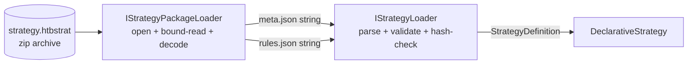

# Strategy Package Format & Loader

> Status: **Draft / proposal** — package schema `1.0`. Builds on the [`Strategy JSON Format`](strategy-json-format.md) (`meta.json` + `rules.json`).
> Layer: **Strategy** (the pure, deterministic signal generator). See [`.claude/skills/architect/references/trading-architecture.md`](../.claude/skills/architect/references/trading-architecture.md) §2.

## 1. Summary

A **strategy package** is the *distribution unit* of a strategy version: a single zip archive carrying the two JSON files that [`strategy-json-format.md`](strategy-json-format.md) defines — `meta.json` (the manifest) and `rules.json` (the algorithm) — at its root. One file to register, ship, sign, and reference by the natural key `(strategy-id, version-number)`.

The **package loader** (`IStrategyPackageLoader`) turns that untrusted archive into a validated, hash-checked `StrategyDefinition`. It owns *only* the archive concerns — entry lookup, untrusted-zip safety, UTF-8 decoding — and **delegates all JSON validation and hashing** to the existing [`IStrategyLoader`](../src/shared/HTB.Shared/Strategy/Abstractions/IStrategyLoader.cs). It adds no new domain types and no new schema rules; it is a safe *intake shape* for the pipeline that already exists.



The core invariant the package layer adds:

> **A package is exactly the two known entries, read safely into memory — no path traversal, no zip-bomb, no silent substitution.** After intake, the existing determinism / hash / look-ahead guarantees take over unchanged.

## 2. Invariants (these drive the design)

1. **Delegation, not duplication.** The package loader never re-implements a single validation rule from [`strategy-json-format.md`](strategy-json-format.md). It produces two `string`s and calls `IStrategyLoader.Load(metaJson, rulesJson)`. Schema version, parameter bounds, hash binding, and the no-look-ahead rule are all enforced *there*.
2. **Faithful bytes.** `rules.json` is decoded as UTF-8 with invalid bytes rejected, so the text handed downstream is byte-faithful — its `sha256` must still equal `meta.version.rules-hash`. The package format must never let a tampered `rules.json` pass the hash check by mangling encoding.
3. **Untrusted input.** The archive is hostile until proven otherwise: malformed zip, missing/duplicate entries, oversized or zip-bombed entries, and path-traversal names are all rejected as typed `StrategyConfigException`s — never an unhandled `InvalidDataException` or an `OutOfMemoryException`.
4. **Structural traversal-immunity.** Entries are matched by **exact root name** (`meta.json`, `rules.json`), and nothing is ever extracted to disk. A `../meta.json` or `sub/meta.json` entry simply is not `meta.json` and is ignored — zip-slip is impossible by construction.
5. **Forward-compatible.** Unknown extra entries (a future `README.md`, a detached `signature`) are ignored, not rejected. Only `rules.json` is hash-bound, so extras cannot change behavior.

## 3. Package layout

A `1.0` package is a standard zip archive (deflate or store) with these entries **at the archive root**:

| Entry | Required | Role | Max size |
| --- | --- | --- | --- |
| `meta.json` | **yes** | Manifest — see [format doc §4](strategy-json-format.md) | 64 KiB |
| `rules.json` | **yes** | Algorithm — see [format doc §5](strategy-json-format.md) | 1 MiB |
| *anything else* | no | Ignored (reserved for future signing / docs) | — |

- **Exact, ordinal names.** `Meta.json` or `rules.JSON` do **not** match; the names are case-sensitive to stay deterministic across filesystems.
- **No nesting.** The two files live at the root, not under `strategies/<id>/`. (On disk during authoring they live under [`strategies/<id>/`](../strategies/); packaging flattens them.)
- **No duplicates.** A package containing two `meta.json` entries is rejected — there must be exactly one of each.
- **Suggested extension:** `.htbstrat`. Not load-bearing — the loader sniffs content, never the filename.

### Building a package (reference)

```bash
# from a strategy's authoring folder
cd strategies/rsi-movement
zip ../../rsi-movement-v1.htbstrat meta.json rules.json
```

## 4. The loader contract

```csharp
namespace HTB.Shared.Strategy.Abstractions;

/// <summary>
/// Reads a strategy package — a zip archive carrying meta.json + rules.json at its
/// root — and produces a validated, hash-checked StrategyDefinition. Owns only the
/// archive concerns (entry lookup, untrusted-zip limits, decoding); delegates all
/// JSON validation to IStrategyLoader. Throws StrategyConfigException on any failure.
/// </summary>
public interface IStrategyPackageLoader
{
    /// <summary>Load from an open, readable, seekable archive stream. The seam for tests.</summary>
    StrategyDefinition Load(Stream package);
}
```

The single method takes a `Stream` — the one testable seam. File-path and `byte[]` intake are caller conveniences (open a `FileStream`, wrap a `MemoryStream`) and deliberately stay *off* the interface so there is exactly one thing to fake.

The implementation is a primary-ctor adapter over the inner loader:

```csharp
public sealed class StrategyPackageLoader(IStrategyLoader inner) : IStrategyPackageLoader
```

The string-pair `IStrategyLoader` remains the pure inner core; the package loader is a sibling composed on top, delegating all schema/hash validation to it.

### 4.1 Check step — `Validate` (non-throwing admission)

Both loaders also expose a **check step** for governance/registry admission:

```csharp
StrategyValidationResult IStrategyLoader.Validate(string manifestJson, string rulesJson);
StrategyValidationResult IStrategyPackageLoader.Validate(Stream package);
```

`Validate` answers *"would this load, and is it runnable?"* and returns a verdict instead of throwing, so a registry can admit/reject (and batch-check many) without try/catch:

```csharp
public sealed record StrategyValidationResult
{
    public bool IsValid { get; }                  // would Load succeed?
    public StrategyDefinition? Definition { get; } // non-null iff IsValid
    public IReadOnlyList<string> Errors { get; }   // empty iff IsValid (0 or 1 today)
    public bool IsRunnable { get; }                // active + hash-verified; a valid draft is not runnable
}
```

- **One source of truth.** `Validate` runs the *same* `Load` path and translates the typed `StrategyConfigException` into a verdict — a verdict can never disagree with an actual load. No second, divergent rule set.
- **`Errors` is a list** (0 or 1 entry today). Multi-error accumulation can be added later without an API break.
- **Null is still a guard, not a verdict.** A null argument is caller misuse → `ArgumentNullException`; only an *invalid strategy* becomes `IsValid == false`.
- **Invariant-by-construction.** `StrategyValidationResult` has a private ctor + `Valid(def)` / `Invalid(msg)` factories: valid ⇒ non-null definition + empty errors; invalid ⇒ null definition + one error.

## 5. Load sequence

```
Load(package)
  │
  ├─ guard: ArgumentNullException.ThrowIfNull(package)
  ├─ open: new ZipArchive(package, Read, leaveOpen: true)   ── InvalidDataException → StrategyConfigException("not a valid zip")
  ├─ resolve meta.json   ── iterate Entries; require exactly one root match
  ├─ resolve rules.json  ── iterate Entries; require exactly one root match
  ├─ read meta.json      ── bounded copy ≤ 64 KiB, UTF-8 strict
  ├─ read rules.json     ── bounded copy ≤ 1 MiB, UTF-8 strict
  └─ return inner.Load(metaJson, rulesJson)                 ── all schema/hash/look-ahead validation happens here
```

The caller owns the stream lifetime (`leaveOpen: true`).

## 6. Untrusted-zip hardening

The archive read is the new attack surface; every hostile shape maps to a typed `StrategyConfigException`:

| Threat | Defense |
| --- | --- |
| **Not a zip** | `ZipArchive` ctor throws `InvalidDataException` → wrapped with a clear message. |
| **Zip-slip / nested path** | Entries matched by exact root name; nothing extracted to disk → traversal structurally impossible (Invariant 4). |
| **Duplicate entry** | Iterate `archive.Entries` (not `GetEntry`, which silently returns the first match); >1 of a required name → reject. |
| **Missing entry** | Reject, naming which file is absent. |
| **Zip bomb** | **Do not trust `entry.Length`** (central-directory header, spoofable). Read through a length-capped copy: read up to `limit + 1` bytes; exceeding the cap throws. Bounds memory regardless of a lying header or extreme compression ratio. |
| **Invalid encoding** | Decode with `new UTF8Encoding(throwOnInvalidBytes: true)` so the string is byte-faithful (Invariant 2). |

## 7. Patterns

- **Adapter / Decorator** — `StrategyPackageLoader` adapts a zip stream onto the existing `IStrategyLoader`: one validation pipeline, two intake shapes.
- **Factory (delegated)** — the "JSON → immutable object" Builder/Factory stays in `StrategyLoader`; the package loader only feeds it.
- **Guard-clause boundary** — all untrusted-input rejection is funneled into the `StrategyConfigException` taxonomy the rest of the subsystem already uses.

## 8. Testing strategy (100% line + branch, by construction)

Pure in-memory — build archives with `ZipArchive` / `ZipArchiveMode.Create` over a `MemoryStream`. No Testcontainers, no clock, no `TimeProvider`.

| Branch | Test |
| --- | --- |
| Happy path | Zip the real [`strategies/rsi-movement/`](../strategies/rsi-movement/) files → `StrategyDefinition` equals the direct `StrategyLoader` result |
| Null stream | `Load(null!)` → `ArgumentNullException` |
| Not a zip | Random bytes → `StrategyConfigException` |
| Missing meta / missing rules | Each separately |
| Duplicate meta / duplicate rules | Two entries with the same name |
| Oversized meta / oversized rules | Entry just over each cap (drives the `limit + 1` branch on both sides) |
| Invalid UTF-8 | Entry with `0xFF 0xFE` garbage |
| Extra entry ignored | Add `README.md`; load still succeeds |
| Delegation | A fake `IStrategyLoader` capturing args asserts the exact strings pass through unaltered |

The fake-`IStrategyLoader` test isolates the package loader from JSON-validation coverage (already owned by the loader's own suite) and proves the seam.

## 9. Risks & open questions

- **Signing.** Out of scope now; the "ignore extra entries" rule (Invariant 5) reserves room for a future detached `signature` entry verifying the archive. Flagged, not built.
- **Size caps are policy.** 64 KiB / 1 MiB are conservative defaults; liftable to constructor options later. Starting strict.
- **Registry integration.** This loader stops at `StrategyDefinition`. *Where packages are stored and resolved by `(strategy-id, version)`* is a separate Strategy-Registry concern (deferred).
- **Buffering, not streaming.** Both entries are read fully into memory — required anyway, since the inner loader takes strings and hashes the whole `rules.json`. No streaming benefit at these sizes.

## 10. File plan

```
src/shared/HTB.Shared/Strategy/Abstractions/IStrategyPackageLoader.cs   (new)
src/shared/HTB.Shared/Strategy/Strategy/StrategyPackageLoader.cs        (new)
tests/shared/HTB.Shared.Tests/Strategy/StrategyPackageLoaderTests.cs    (new)
```

No `csproj` changes — `System.IO.Compression` ships in the framework. Reuses the existing `StrategyConfigException`, `IStrategyLoader`, and `StrategyTestData` fixtures.
